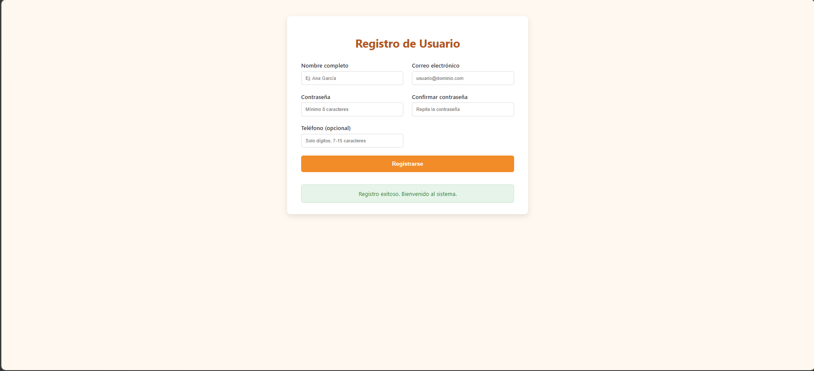
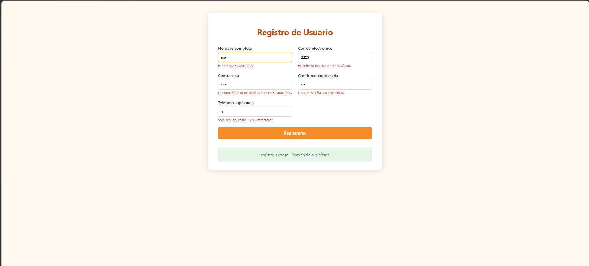
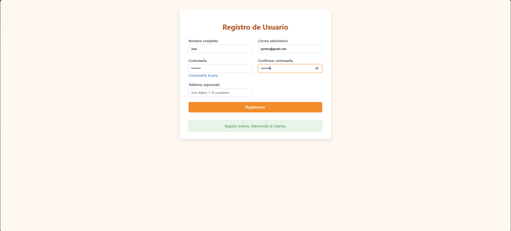
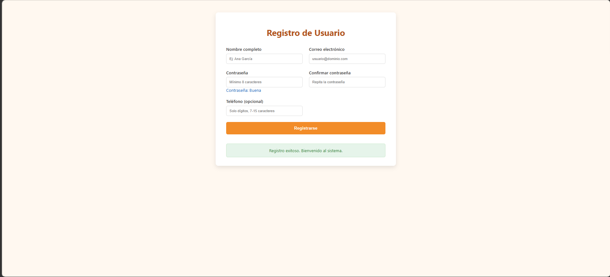

# Registro de Usuario - Unidad 4 (JavaScript Básico)

## Descripción del Proyecto
Este proyecto corresponde al **Laboratorio Post-Contenido 2 de la Unidad 4: JavaScript Básico** de la asignatura **Programación Web** en Ingeniería de Sistemas (UDES).  
El objetivo es implementar un formulario de registro de usuario con **validación completa del lado del cliente**, combinando:

- Validación manual mediante **JavaScript**.
- Uso de la **Constraint Validation API** nativa del navegador.
- Retroalimentación visual inmediata por campo.
- Control del evento `submit` para evitar envíos inválidos.
- Expresiones regulares para validar formatos.
- Uso de características **ES6** (destructuring, template literals, arrow functions).

---

## Tecnologías Utilizadas
- **HTML5**
- **CSS3**
- **JavaScript (ES6)**
- **Git/GitHub**
- **Visual Studio Code + Live Server** 
- **Google Chrome + DevTools**

---

## Instrucciones de Ejecución
1. Clonar el repositorio:
   ```bash
   git clone https://github.com/usuario/apellido-post2-u4.git

1. Estructura Base


2. Errores presentados


3. Estructura validada


4. Registro exitoso
